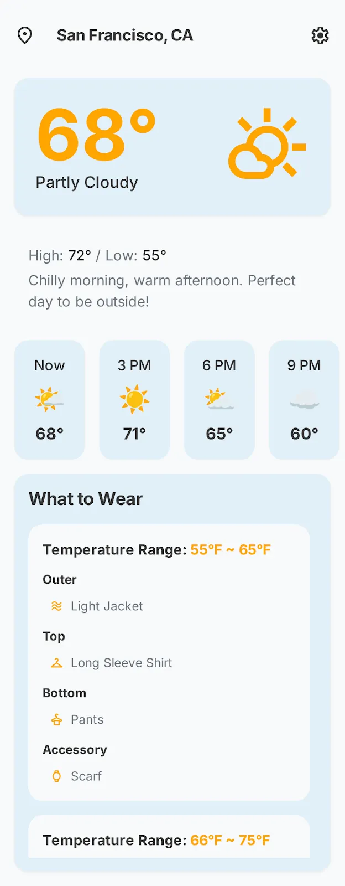

# UI 요구사항

## 레퍼런스

## 요구사항

**화면 이름: 날씨 & 옷차림 홈**

**플랫폼:** 모바일 앱

**핵심 내용:** 사용자가 현재 날씨와 옷차림 정보를 한눈에 파악하고 빠르게 의사결정을 내릴 수 있는 단일 홈 화면입니다.

**주요 구성 요소:**

1. **상단 날씨 정보:**
    - 화면 가장 상단에는 사용자가 현재 위치한 도시가 보여집니다.
    - 현재 날씨가 크게 표시됩니다.
    - 좌우로 스크롤하여 3시간 단위의 날씨 예보를 확인할 수 있습니다.
    - 각 시간대의 날씨는 이모티콘과 섭씨(°C) 온도로 표시됩니다.
2. **날씨 분석:**
    - 최소/최고 기온과 함께 날씨에 대한 간략한 코멘트가 제공됩니다.
3. **추천 옷차림 카테고리 (수정된 사항):**
    - `온도 범위` (예: "17°C ~ 19°C")가 명확하게 표시됩니다.
    - 여러개의 온도 범위에 대한 옷차림 추천이 동시에 표시될 수 있습니다.
    - 각 온도 범위 내에서 '아우터', '상의', '하의', '악세서리' 카테고리별로 구체적인 옷차림 항목들이 나열됩니다.
    - 모든 카테고리 요소와 옷차림 항목이 복잡해 보이지 않도록 수직 스크롤 기능을 통해 접근 가능하도록 디자인되었습니다.
4. 기타
    - UI의 실제 문구들은 한국어로 표시된다.  
    - 화면에 표시된 설정 버튼은 구현하지 않는다.
   
   - 옷 카테고리 이미지는 다음의 이모티콘을 사용한다.    
     🧥 아우터
     👕 상의
     👖 하의
     🧢 악세서리
   
   - 날씨는 다음의 이모티콘을 사용한다.  
       

| weatherMain                                                | 한글 설명 | 이모티콘 | 비고                               |
| ------------------------------------------------------------- | ------- | -- | ---------------------------------- |
| **Thunderstorm**                                              | 천둥번개    | ⛈️ | 천둥, 번개, 폭풍우                        |
| **Drizzle**                                                   | 이슬비     | 🌦️ | 약한 비, 가벼운 강수                       |
| **Rain**                                                      | 비       | 🌧️ | 일반적인 비, 소나기 포함                     |
| **Snow**                                                      | 눈       |  ❄️ | 눈 또는 진눈깨비                          |
| **Clear**                                                     | 맑음      | ☀️ 🌙 | 구름 거의 없음                           |
| **Clouds**                                                    | 구름      |  ☁️  | 흐림, 구름 많음 등                        |
| **Mist**                                                      | 안개      | 🌫️ | 희박한 대기, 약한 안개                      |

  
